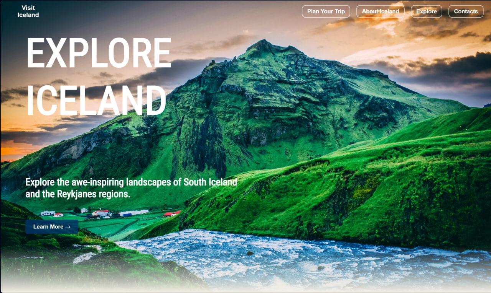

# Visit Iceland - Travel Guide

A modern, responsive landing page designed to provide travelers with essential information about visiting Iceland. The project focuses on clean UI, smooth navigation, and high accessibility standards.

## Features
- **Semantic Structure:** Built with HTML5 semantic elements (`header`, `nav`, `main`, `section`, `footer`) for better SEO and screen reader support.
- **Responsive Design:** Fully adaptive layout using CSS Flexbox, ensuring a seamless experience on mobile, tablet, and desktop devices.
- **Interactive Elements:** Smooth scroll-to-section navigation and integrated media content (YouTube iframe).
- **Data Visualization:** Structured tables for travel cost estimations, including flights, accommodation, and food.

## WCAG & Accessibility Compliance
The website was developed with **WCAG 2.1** guidelines in mind to ensure it is accessible to all users:
- **High Contrast & Typography:** Used accessible font families (Montserrat, Raleway, Roboto) and ensured sufficient color contrast for readability.
- **Logical Heading Hierarchy:** Proper use of `h1` through `h3` tags to create a clear document outline.
- **Semantic Markup:** Heavy reliance on semantic tags instead of generic `div` containers to provide context to assistive technologies.
- **Interactive Controls:** Buttons and links are designed to be easily identifiable and interactive.

## Tech Stack
- **HTML5:** For structure and accessibility.
- **CSS3:** For custom styling, layout, and responsiveness.
- **Google Fonts:** Montserrat, Roboto Condensed, and Raleway.

## Project Structure
- `index.html` — The core structure of the website.
- `main.css` — Custom styles and responsive queries.
- `img/` — Directory containing all landscape and UI assets.
- `docs/` — Documentation and project preview images.

## Preview

## How to Run
Simply open `index.html` in any web browser or host it via GitHub Pages.

## License
MIT
